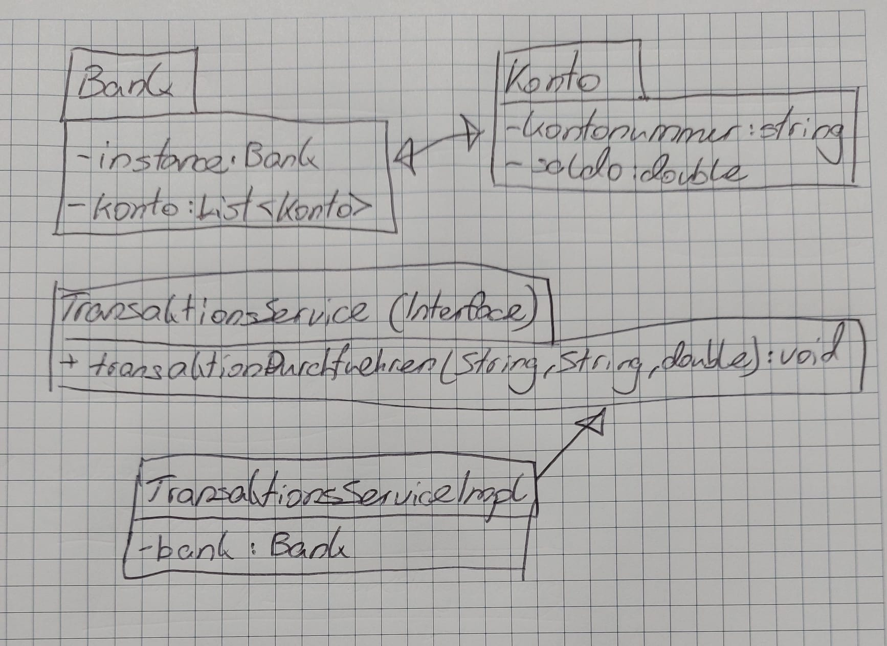
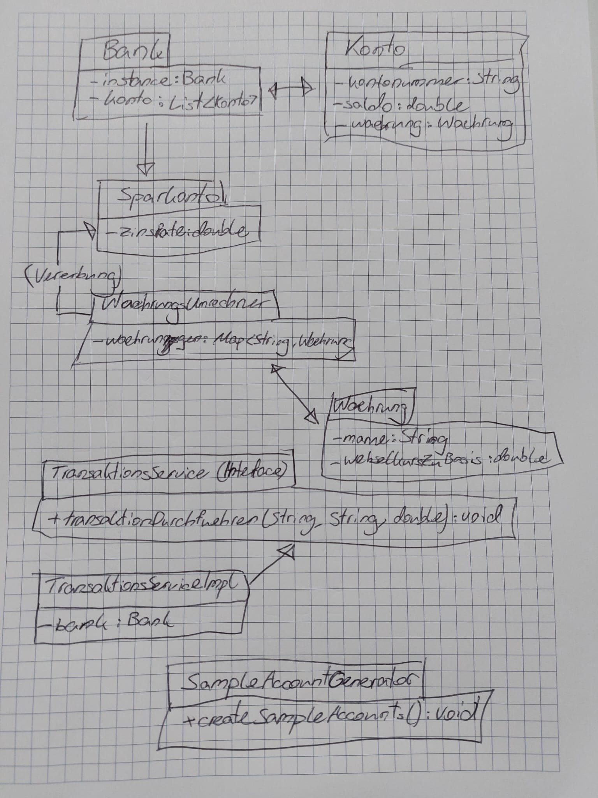
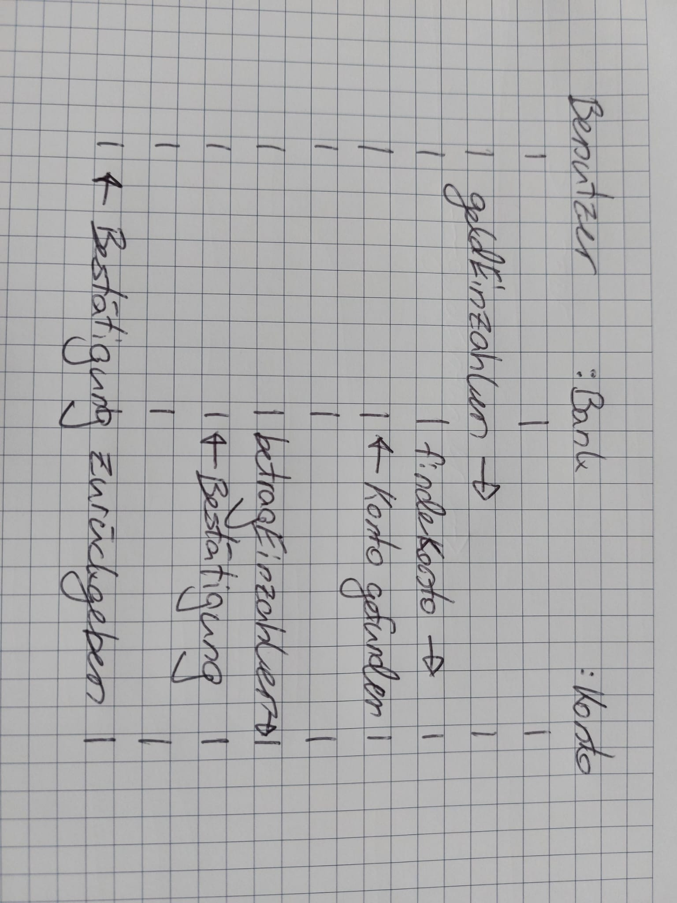

# Bank-System-Projekt

## 1. Projektübersicht

Dieses Projekt implementiert ein Bank-System, das Kundenkonten, Sparkonten und Transaktionen verwaltet. Hauptfunktionen sind:
- Erstellung von Konten und Sparkonten
- Verwaltung von Ein- und Auszahlungen
- Durchführung von Überweisungen zwischen Konten
- Nutzung des Singleton-Design-Patterns zur Sicherstellung einer einzigen Bank-Instanz

Das Projekt besteht aus den folgenden Klassen:
- `Konto`: Basisklasse für normale Konten
- `Sparkonto`: Unterklasse von `Konto`, fügt Zinsen hinzu
- `Bank`: Singleton-Klasse, die alle Konten verwaltet
- `TransaktionsService`: Schnittstelle zur Abwicklung von Transaktionen
- `TransaktionsServiceImpl`: Implementierung der Transaktionslogik

## 2. Initiales Architekturdiagramm (Klassendiagramm)

### Beschreibung der Architektur

- `Konto`: Repräsentiert ein einfaches Konto, ermöglicht Einzahlungen und Abhebungen.
- `Sparkonto`: Erweitert `Konto` um die Fähigkeit, Zinsen zu berechnen und zu buchen.
- `Bank`: Verwaltet alle Konten und bietet ein Menü für die Benutzerinteraktion. Verwendet das Singleton-Pattern.
- `TransaktionsService` und `TransaktionsServiceImpl`: Definiert und implementiert die Logik für Überweisungen zwischen Konten.

## 3. Verwendung des Design-Patterns

### Singleton-Pattern

**Design-Pattern**: Singleton  
**Anwendung**: Die Klasse `Bank` verwendet das Singleton-Pattern, um sicherzustellen, dass nur eine Instanz der Bank existiert.  
**Begründung**: Da es nur eine zentrale Bank-Instanz geben sollte, über die alle Konten und Operationen verwaltet werden, verhindert das Singleton-Pattern die unkontrollierte Erzeugung mehrerer Bank-Instanzen.

## 4. Abschluss des Projekts

### Abschliessendes Klassendiagramm

### Vergleich der initialen und abschliessenden Architektur

## 5. Sequenzdiagramm für einen Use-Case

